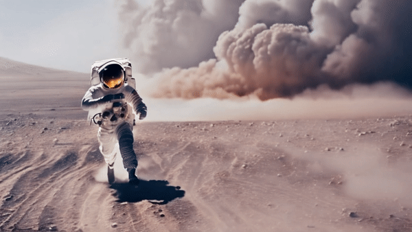

# AILab-CVC/VideoCrafter Cog model

This is an implementation of the [AILab-CVC/VideoCrafter](https://github.com/AILab-CVC/VideoCrafter) as a Cog model. [Cog packages machine learning models as standard containers.](https://github.com/replicate/cog)

First, download the pre-trained weights:

    cog run script/download-weights

Then, you can run predictions:

    cog predict -i prompt="an astronaut running away from a dust storm on the surface of the moon, the astronaut is running towards the camera, cinematic"

## Example:

"an astronaut running away from a dust storm on the surface of the moon, the astronaut is running towards the camera, cinematic"

